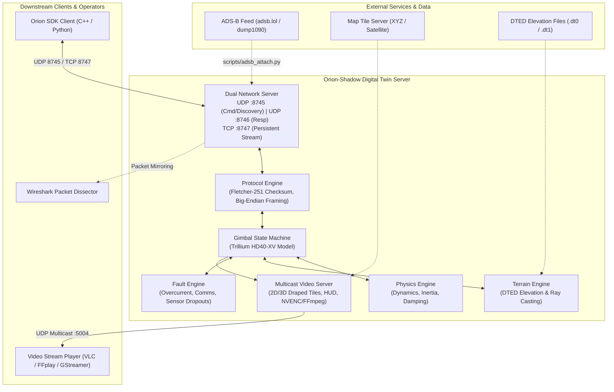

# Orion-Shadow Documentation Hub

Welcome to the **Orion-Shadow** documentation hub. Orion-Shadow is a high-fidelity Software-in-the-Loop (SIL) and Hardware-in-the-Loop (HIL) digital twin simulator for Trillium Engineering Orion gimbal and camera systems. It specifically models the **Trillium HD40-XV** electro-optical gimbal payload and implements the **OrionPublic Protocol v1.4.0** (targeting **Orion SDK 3.1.9**).

This documentation suite serves as a comprehensive, modular "one-stop shop" covering every aspect of the software: network protocols, state machines, dynamics, terrain simulation, synthetic video streaming, payload controls, live ADS-B flight tracking, configuration, and SDK integration.

---

## 🗺️ Documentation Map

The documentation is organized into focused, cross-referenced topic guides:

| Document | Description |
| :--- | :--- |
| **[Architecture & Concurrency](architecture.md)** | Internal software structure, `asyncio` concurrency, execution loops, and dataflow pipelines. |
| **[Protocol & Network Specification](protocol_network.md)** | Port assignments (`8745`, `8746`, `8747`), packet framing, Fletcher-251 checksum, and full packet dictionary. |
| **[Physics & State Machine](physics_state_machine.md)** | Trillium HD40-XV mechanical model, operating modes (`RATE`, `POSITION`, `GEOPOINT`), and Euler dynamics. |
| **[Terrain & Geospatial Engine](terrain_geospatial.md)** | DTED parsing (`.dt0`–`.dt1`), WGS84 geodetic transformations, bilinear interpolation, and ray-casting geolocation. |
| **[Synthetic Video & Rendering](video_rendering.md)** | 2D tile visualizer, 3D draped terrain renderer, HUD symbology, FFmpeg multicast, and GPU/NVENC acceleration. |
| **[Camera, Payloads & Tracking](camera_payloads_tracking.md)** | 1x–112x zoom & HFOV math, KTnC camera protocol emulation, video tracking engine, laser subsystem, and fault injection. |
| **[ADS-B Live Flight Bridge](adsb_integration.md)** | Attaching the gimbal to live real-world flights using open ADS-B feeds and an interactive TUI. |
| **[CLI & Configuration Reference](cli_configuration.md)** | Full command-line option reference, configuration parameters, runner scripts, and performance tuning. |
| **[Integration Guide](integration_guide.md)** | Pairing with the Orion SDK (C++ and Python), Wireshark Lua dissector setup, VLC/ffplay video reception, and troubleshooting. |
| **[Testing & Development](testing_development.md)** | Test runner architecture (`scripts/pytest`), unit/integration test suite, mock DTED generation, and contributing guide. |
| **[Technical Reference Card](technical_reference.md)** | Quick-reference cheat sheet for packet structures, port numbers, and common developer workflows. |

---

## 🏗️ High-Level System Overview

The following diagram illustrates how Orion-Shadow bridges external controllers, software applications, video players, and live aircraft feeds:



---

## ⚡ Quick-Start Summary

### 1. Installation
Clone the repository and install dependencies in editable mode:
```bash
cd /home/user/dev/orion-shadow
pip install -e .
```

### 2. Launch the Simulator
Run the simulator on standard ports with simulated coordinates:
```bash
python3 -m orion_shadow.server --lat 39.6 --lon -116.3 --alt 2500 --heading 90
```

Or execute the pre-configured runner script:
```bash
./scripts/run.sh
```

### 3. Connect Video Stream
Open VLC or ffplay to watch the real-time synthesized camera view and HUD:
```bash
ffplay -fflags nobuffer -flags low_delay udp://239.255.0.1:5004
```

### 4. Connect Your Orion SDK Application
Point your Orion SDK application to `localhost:8747` (TCP) or `localhost:8745` (UDP) to start sending gimbal commands and receiving live telemetry.
