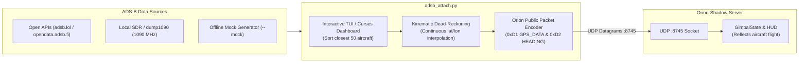

# ADS-B Live Flight Bridge

This document describes the live ADS-B flight tracking bridge (`scripts/adsb_attach.py`) that attaches the simulated Orion gimbal to real-world airborne aircraft in real time.

---

## ✈️ Overview

The ADS-B integration allows developers and system evaluators to simulate real-world flight missions without needing a flight simulator or flight log replay files.

By querying public, keyless Automatic Dependent Surveillance–Broadcast (ADS-B) aggregators or local ADS-B receivers (`dump1090`, `readsb`), the script:
1. Discovers and ranks the closest airborne flights within a specified nautical mile radius.
2. Provides an interactive Terminal User Interface (TUI) to inspect aircraft call signs, altitudes, groundspeeds, distances, and headings.
3. Automatically translates the selected aircraft's live GPS coordinates, altitude, groundspeed, and track into **`ORION_PKT_GPS_DATA` (`0xD1`)** and **`ORION_PKT_EXT_HEADING_DATA` (`0xD2`)** UDP packets.
4. Streams this navigation data into the Orion-Shadow server so the gimbal's attitude, line-of-sight calculations, terrain intersections, and video HUD reflect the real flight path.



---

## 🖥️ Interactive Terminal UI (TUI)

When run in an interactive terminal, `adsb_attach.py` renders a full-screen curses dashboard:

```
===================================================================================================
ORION SHADOW - ADS-B AIRCRAFT ATTACH & TELEMETRY BRIDGE
Center: 39.6000°N, 116.3000°W | Radius: 100 NM | Source: adsb.lol | Connected: 127.0.0.1:8745
===================================================================================================
 #  CALLSIGN   HEX     TYPE   ALT (FT)   SPD (KTS)  HDG   DIST (NM)  BEARING   STATUS
---------------------------------------------------------------------------------------------------
 1  UAL1842    A43B21  B738    34,000       462     088°    12.4 NM     ENE     STREAMING >>>
 2  SWA412     A1290C  B737    28,000       410     260°    18.7 NM     WSW     AVAILABLE
 3  DAL902     A884FE  A321    37,000       485     092°    24.1 NM     E       AVAILABLE
 4  N142SP     A0AE23  C172     4,500       112     315°    31.8 NM     NW      AVAILABLE
...
---------------------------------------------------------------------------------------------------
[UP/DOWN] Select Aircraft | [ENTER] Attach/Lock | [SPACE] Pause | [M] Toggle Mock | [Q] Quit
Active Target: UAL1842 | Streaming Rate: 2.0 Hz | Camera Tilt: -20.0°
```

### Controls
- **`Up` / `Down` Arrow Keys**: Scroll through the closest 50 aircraft.
- **`Enter`**: Lock onto highlighted aircraft and immediately start streaming telemetry to Orion-Shadow.
- **`Spacebar`**: Pause/resume coordinate streaming.
- **`T` / `Shift+T`**: Adjust commanded gimbal tilt angle ($+28^\circ$ to $-80^\circ$).
- **`R`**: Force an immediate refresh of the ADS-B network table.
- **`Q` / `Esc`**: Safely disconnect and quit.

---

## 📡 Telemetry Packet Injection

The bridge packages aircraft kinematics into standard OrionPublic packets:

### 1. `ORION_PKT_GPS_DATA` (`0xD1`)
- **Latitude / Longitude**: Converted to scaled 32-bit signed integers ($10^7 \times \text{degrees}$).
- **Altitude MSL**: Scaled 32-bit integer ($1000 \times \text{meters}$).
- **Groundspeed**: Converted from knots to meters/second ($100 \times \text{m/s}$).
- **Course Over Ground**: Scaled 16-bit integer ($1000 \times \text{radians}$).

### 2. `ORION_PKT_EXT_HEADING_DATA` (`0xD2`)
- **True Heading**: Scaled 16-bit integer ($1000 \times \text{radians}$).
- **Heading Validity**: Sets bit flag `0x01` indicating valid inertial/compass reference.

---

## 💻 CLI Usage & Examples

### 1. Launch Interactive TUI near Specific Coordinates
```bash
# Center search near Dayton, OH (lat: 39.75, lon: -84.19)
python3 scripts/adsb_attach.py --lat 39.75 --lon -84.19 --radius 80.0
```

### 2. Automated Non-Interactive Mode (Headless / CI)
Attach directly to the closest aircraft without rendering the curses TUI:
```bash
python3 scripts/adsb_attach.py \
  --lat 39.6 --lon -116.3 \
  --headless \
  --select closest \
  --rate 5.0 \
  --tilt -25.0
```

Attach to a specific known flight call sign:
```bash
python3 scripts/adsb_attach.py \
  --headless \
  --select "UAL1842" \
  --orion-host 127.0.0.1 \
  --orion-port 8745
```

### 3. Offline Testing with Mock Traffic Generator
When operating without an internet connection or test flight feed:
```bash
python3 scripts/adsb_attach.py --mock --headless --select closest
```

### 4. Runner Shell Script
A convenient shortcut script is provided in `scripts/adsb.sh`:
```bash
./scripts/adsb.sh
```

---

## ⚙️ Command-Line Arguments Reference

| Argument | Type | Default | Description |
| :--- | :--- | :--- | :--- |
| `--lat` | `float` | `34.0522` | Reference center latitude |
| `--lon` | `float` | `-118.2437` | Reference center longitude |
| `--radius` | `float` | `100.0` | Search radius in Nautical Miles |
| `--limit` | `int` | `50` | Maximum number of aircraft to fetch and display |
| `--endpoint` | `str` | `adsb.lol` | Custom ADS-B API URL or local JSON feed |
| `--orion-host` | `str` | `127.0.0.1` | IP address of the Orion-Shadow server |
| `--orion-port` | `int` | `8745` | UDP port for Orion commands (`UDP_OUT_PORT`) |
| `--rate` | `float` | `2.0` | Telemetry transmission rate in Hz |
| `--tilt` | `float` | `-20.0` | Initial camera tilt angle in degrees |
| `--mock` | `flag` | `False` | Force internal mock traffic generator |
| `--headless` | `flag` | `False` | Run in non-interactive batch/script mode |
| `--select` | `str` | `None` | Auto-select target (`closest`, callsign, hex, or index 1..50) |
| `--count` | `int` | `0` | Stop after transmitting $N$ packets (0 = infinite) |
