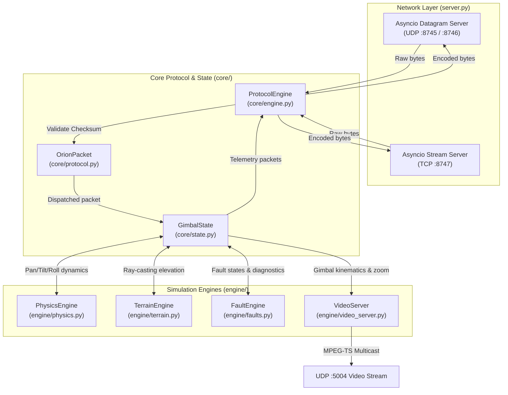
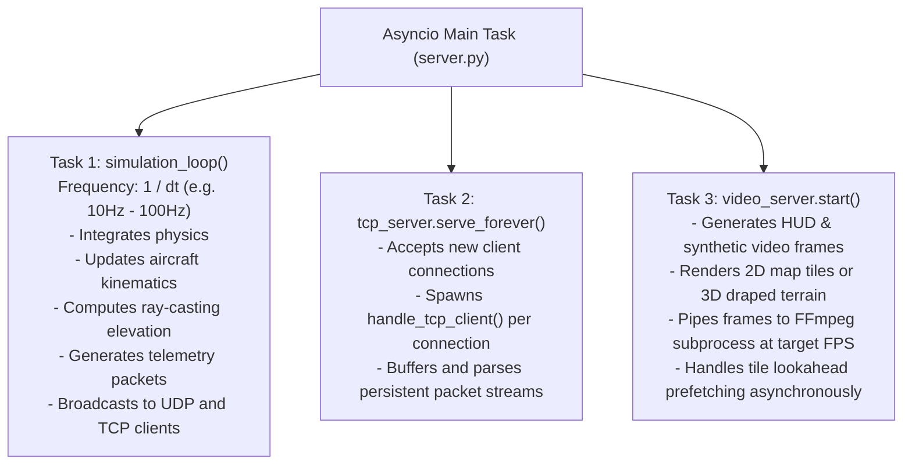

# Architecture & Concurrency Model

This document outlines the internal architecture, asynchronous runtime model, and subsystem communication pipelines of **Orion-Shadow**.

---

## 🏛️ High-Level Design Principles

Orion-Shadow is architected as an asynchronous, modular digital twin of the Trillium Engineering Orion Crown controller. It operates under two primary deployment paradigms:

1. **Software-in-the-Loop (SIL)**:
   - High-speed simulation running on standard developer workstations or CI runners.
   - Typically configured with larger physics timesteps ($\Delta t = 0.1\text{s}$, 10 Hz) for rapid functional validation of control algorithms, mission software, and network messaging.

2. **Hardware-in-the-Loop (HIL)**:
   - Real-time simulation connecting physical hand controllers, mission computers, or embedded autonomy payloads over a local Ethernet link.
   - Operates at high update rates ($\Delta t = 0.01\text{s}$ or $0.001\text{s}$, 100–1000 Hz) to match physical sensor sampling rates and low-latency control loops.

---

## 🧩 Subsystem Modular Breakdown

The codebase is split into two primary packages under `src/orion_shadow/`:

```
src/orion_shadow/
├── core/
│   ├── protocol.py       # Binary packet framing, Fletcher-251 checksum, packet types
│   ├── engine.py         # Protocol parser, packet dispatcher, handler callbacks
│   └── state.py          # Central GimbalState, Trillium HD40-XV model, mode logic
├── engine/
│   ├── physics.py        # Dynamics, Euler integration, acceleration/velocity clamping
│   ├── terrain.py        # DTED parser (.dt0-.dt2), geodetic coordinate transformations
│   ├── terrain_renderer.py # 3D ray-marching relief draped with map tiles
│   ├── visualizer.py     # Slippy map tile fetcher, disk cache, homography projection
│   ├── video_server.py   # Synthetic video generator, HUD overlay, FFmpeg multicast
│   └── faults.py         # Fault injection engine for hardware resilience testing
└── server.py             # Asynchronous dual UDP/TCP network server & CLI orchestrator
```

### Subsystem Interaction Matrix



---

## ⚡ Asynchronous Concurrency Model

Orion-Shadow is built natively on Python's standard `asyncio` event loop. It avoids thread-locking and shared-memory race conditions by coordinating simulation tasks cooperatively on a single event loop.

### Concurrency Task Tree

When `OrionServer.run()` starts, it initializes and manages several concurrent asynchronous tasks:



### Telemetry & Simulation Loop (`simulation_loop`)
The simulation loop is the heartbeat of the simulator:
1. **Sleep Delay**: `await asyncio.sleep(self.dt)` maintains the requested simulation tick rate.
2. **Kinematic Update**: If aircraft speed is non-zero, aircraft latitude and longitude are updated using dead-reckoning equations along the aircraft heading vector.
3. **Physics Step**: `self.state.step()` invokes the physics integrator to compute new axis velocities, positions, and damping.
4. **Target Ray-Casting**: In Geopoint mode or when calculating target telemetry, the engine intersects the camera optical axis with the DTED terrain surface.
5. **Periodic Telemetry Generation**: At designated sub-rates, the engine packages:
   - `ORION_PKT_POSITIONS` (`0x0A`) at high frequency.
   - `ORION_PKT_GEO_DATA` (`0x0C`) and `ORION_PKT_DIAGNOSTICS` (`0x0B`) at intermediate frequencies.
   - `ORION_PKT_CAMERAS` (`0x03`) and `ORION_PKT_VERSION` (`0x02`) on initialization or periodic keep-alive.
6. **Broadcast**: Packets are simultaneously transmitted to all registered UDP client tuples and all active TCP client streams.

---

## 🔄 Inbound & Outbound Dataflow Pipeline

### 1. Inbound Command Pipeline
When an SDK client sends a command packet:
1. **Reception**:
   - For UDP: `OrionUDPProtocol.datagram_received(data, addr)` receives the packet and records `addr` in `self.clients`.
   - For TCP: `handle_tcp_client` reads bytes from `StreamReader` and buffers incoming fragments.
2. **Framing & Checksum Verification**:
   - `ProtocolEngine.parse()` searches for the `0xD0 0x0D` sync pattern.
   - Computes the modified Fletcher-16 checksum over bytes `[0 .. L+3]`.
   - Compares the computed checksum against the trailing 2 bytes. Discards corrupt frames.
3. **Command Processing**:
   - Valid packets are forwarded to `GimbalState.update_from_command(packet)`.
   - If the packet is `ORION_PKT_CMD` (`0x01`), the state machine updates the target pan, tilt, or rate depending on the requested mode (`RATE`, `POSITION`, or `GEOPOINT`).
   - If the packet is `ORION_PKT_INITIALIZE` (`0x00`), the client is marked active, and a response handshake is queued.
4. **Command Echoing**:
   - Following native Trillium Orion gimbal behavior, incoming configuration and command packets are immediately echoed back to all connected clients, allowing external monitoring tools to stay synchronized.

### 2. Outbound Telemetry Pipeline
1. `GimbalState` extracts current sensor measurements: pan/tilt encoders, IMU angular rates, camera zoom/focus, power rail voltages, and ground intersection coordinates.
2. Packs the binary payload using Python's `struct.pack` with big-endian (`>`) format specifiers.
3. Wraps the payload in an `OrionPacket` instance and executes `encode()`, appending the sync header, length, and Fletcher-251 checksum.
4. Dispatches the serialized bytes across:
   - UDP transport: `self.transport.sendto(data, client_addr)`
   - TCP sockets: `writer.write(data)` followed by `await writer.drain()`

---

## 🛡️ Error Handling and Fault Resilience

- **Socket Exceptions**: Unhandled network disconnections (e.g. client resets, broken pipes) are captured and safely pruned from `self.clients` and `self.tcp_clients` without interrupting the simulation loop.
- **Malformed Packets**: Packets with truncated payloads or invalid Fletcher-251 checksums are rejected at the parsing layer, preventing corrupted state transitions.
- **Graceful Shutdown**: Intercepts `KeyboardInterrupt` and `SIGINT`/`SIGTERM` to cleanly terminate FFmpeg subprocesses, flush tile download sessions, close client sockets, and release UDP/TCP port bindings.
