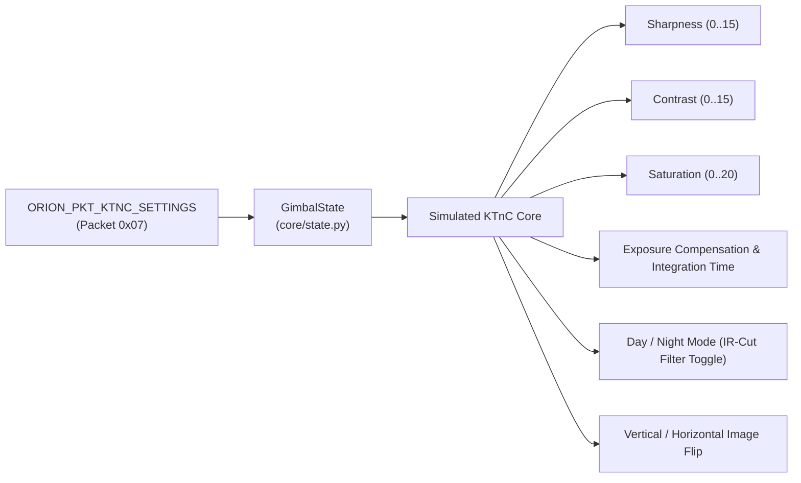
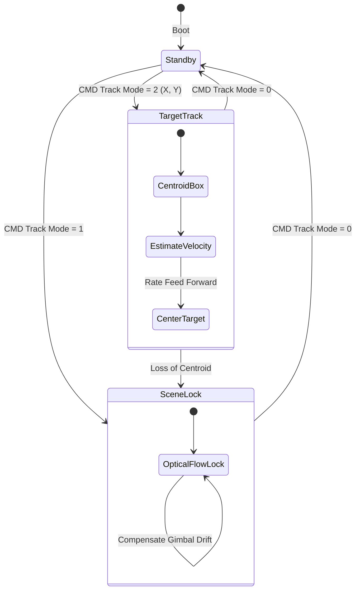

# Camera, Payloads & Tracking

This document details the electro-optical payload simulation, zoom optics, KTnC camera protocol emulation, video tracking algorithms, laser subsystem, and hardware fault injection engine in **Orion-Shadow**.

---

## 📷 Optical Sensor: Trillium HD40-XV EO Core

The **HD40-XV** payload houses a continuous-zoom electro-optical camera core utilizing the **KTnC protocol**. Orion-Shadow models the exact optical geometry, focal length progression, pixel pitch, and horizontal field of view (HFOV).

```
   Wide Angle (1.0x Zoom)                      Telephoto (30.0x - 112.0x)
   f = 4.3mm, HFOV = 47.7°                     f = 129.0mm, HFOV = 1.8° - 0.4°
         \               /                                  |     |
          \             /                                   |     |
           \           /                                    |     |
            \         /                                     |     |
             \       /                                      |     |
              +-----+                                       +-----+
              |Lens |                                       |Lens |
              +-----+                                       +-----+
              |CMOS |                                       |CMOS |
              +-----+                                       +-----+
```

### Optical Parameters

| Parameter | Specification | Simulation Implementation |
| :--- | :--- | :--- |
| **Sensor Type** | $1/2.8\text{''}$ CMOS Image Sensor | Native $1280 \times 720$ resolution |
| **Pixel Pitch** | $2.97\,\mu\text{m}$ ($0.00297\text{ mm}$) | Used for optical ray divergence |
| **Focal Length ($f$)** | $4.3\text{ mm}$ (Wide) to $129.0\text{ mm}$ (Tele) | Continuous scaling with zoom factor |
| **Optical Zoom** | $1.0\times$ to $30.0\times$ | Physical optical lens group motion |
| **Digital Zoom** | $1.0\times$ to $3.73\times$ ($30\times - 112\times$ total) | Sensor crop / software interpolation |
| **Wide HFOV** | $47.7^\circ$ at $1.0\times$ zoom | Wide situation awareness mode |
| **Optical Tele HFOV**| $1.8^\circ$ at $30.0\times$ optical zoom | Long-range target identification |
| **Narrow Max HFOV** | $0.4^\circ$ at $112.0\times$ total zoom | Extreme focal magnification |

---

## 📐 Zoom & Field of View Mathematics

When an application commands a zoom factor $Z \ge 1.0$ via `ORION_PKT_CAMERA_CMD` (`0x04`), the simulator computes the effective focal length and instantaneous Field of View:

### 1. Focal Length Scaling
$$f(Z) = f_{\min} \cdot \min(Z, Z_{\text{optical\_max}}) = 4.3\text{ mm} \cdot \min(Z, 30.0)$$

### 2. Horizontal Field of View (HFOV)
Using standard pinhole lens geometry with effective sensor width $W_{\text{sensor}} = 1280 \times 0.00297\text{ mm} = 3.8016\text{ mm}$:
$$\text{HFOV}(Z) = 2 \cdot \arctan\left( \frac{W_{\text{sensor}}}{2 \cdot f(Z) \cdot D(Z)} \right)$$
where $D(Z)$ represents the digital crop factor:
$$D(Z) = \max\left(1.0, \frac{Z}{30.0}\right)$$

### 3. Vertical Field of View (VFOV)
With a 16:9 aspect ratio ($H_{\text{sensor}} = 720 \times 0.00297\text{ mm} = 2.1384\text{ mm}$):
$$\text{VFOV}(Z) = 2 \cdot \arctan\left( \frac{H_{\text{sensor}}}{2 \cdot f(Z) \cdot D(Z)} \right)$$

---

## 🎛️ KTnC Camera Protocol Emulation (`0x07`)

The camera payload exposes register-level image signal processor (ISP) controls matching Trillium's KTnC interface (`ORION_PKT_KTNC_SETTINGS`):



### Controllable Parameters

| Parameter | Type / Range | Default | Functional Effect |
| :--- | :--- | :--- | :--- |
| `ktnc_sharpness` | `uint8` ($0..15$) | `8` | Edge enhancement filter intensity in renderer |
| `ktnc_contrast` | `uint8` ($0..15$) | `8` | Dynamic range histogram stretching |
| `ktnc_saturation` | `uint8` ($0..20$) | `14` | Color saturation (0 = monochrome/grayscale) |
| `ktnc_exposure_comp`| `uint8` ($0..14$) | `7` | Target auto-exposure bias |
| `ktnc_night_mode` | `uint8` ($0$ or $1$) | `0` | Simulates mechanical IR-cut filter retraction |
| `ktnc_vertical_flip`| `uint8` ($0$ or $1$) | `0` | $180^\circ$ vertical sensor orientation flip |

---

## 🎯 Video Tracking Engine

Orion-Shadow models the autonomous onboard video tracking engine found on Orion Crown processors:



### Tracking Modes
1. **Scene Lock (`Mode 1`)**:
   - Locks the camera gaze onto background terrain features using simulated optical flow.
   - Eliminates angular drift caused by aircraft turbulence or aircraft turns.
2. **Target / Centroid Track (`Mode 2`)**:
   - Acquires a moving vehicle or ground feature at normalized coordinates $(X, Y) \in [0.0, 1.0]$.
   - Telemetry packet `ORION_PKT_VIDEO_TRACK_STATE` (`0x09`) continually reports the estimated target bounding box width, height, coordinates, and tracking confidence ($0..100\%$).
   - Feeds rate corrections into the gimbal physics engine to keep the target centered in the video reticle.

---

## 🔦 Laser Subsystem (`0x10` & `0x11`)

Orion-Shadow models an integrated eye-safe Laser Rangefinder (LRF) and infrared target illumination pointer:

- **`ORION_PKT_LASER_CMD` (`0x10`)**:
  - Arming toggle (prevents accidental firing).
  - Commanded pulse rate and power level ($0.0 - 1.0$).
- **`ORION_PKT_LASER_STATE` (`0x11`)**:
  - Telemetry reporting laser firing status, pulse counter, and thermal feedback.
  - Interlocks with the Terrain Engine: when active, validates whether the laser range return matches the computed DTED terrain slant range.

---

## ⚠️ Fault Injection Engine (`engine/faults.py`)

To allow robust testing of client error handling, watchdog timeouts, and safety failsafes, Orion-Shadow includes a programmatic **FaultEngine**.

### Supported Fault Types

| Fault String | Numeric ID | Hardware Symptom Simulated |
| :--- | :--- | :--- |
| `motor_overcurrent` | `1` | Excessive motor torque load; pan/tilt jitter; thermal flag raised |
| `sensor_timeout` | `2` | Gyro/encoder bus timeout; `is_faulty = True`; freezes telemetry angles |
| `comms_loss` | `3` | Crown board bus disconnect; clears `initialized` state; commands dropped |

### Injecting and Clearing Faults via Code / Tests
```python
from orion_shadow.engine.faults import FaultEngine

# Inject a simulated motor overcurrent fault
state.faults.inject_fault("motor_overcurrent", severity=0.85)

# Verify active fault IDs (transmitted in ORION_PKT_DIAGNOSTICS 0x0B)
active_ids = state.faults.get_active_fault_ids()  # [1]

# Clear faults to return to nominal operation
state.faults.clear_faults()
```
Active faults are reported directly inside byte 16 of `ORION_PKT_DIAGNOSTICS` (`0x0B`), allowing ground control stations to trigger warning annunciators.
