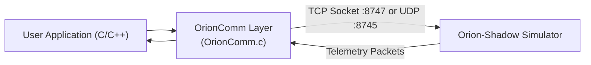

# Orion SDK & Downstream Integration Guide

This guide provides step-by-step instructions for connecting the **Orion SDK** (C/C++ and Python), configuring **Wireshark** packet dissectors, consuming the multicast video feed, and diagnosing common integration issues.

---

## 🔌 Connecting with the Orion C/C++ SDK

The Trillium Orion C/C++ SDK connects to Orion-Shadow using standard socket abstractions provided in `Communications/OrionComm.h`.



### 1. Persistent TCP Connection (Recommended)
Open a persistent TCP session to `TCP_PORT` (`8747`):

```c
#include "OrionComm.h"

OrionComm_t comm;
// Initialize TCP connection to the simulator IP
if (OrionCommOpen(&comm, "127.0.0.1", TCP_PORT, ORION_COMM_TCP))
{
    printf("Successfully connected to Orion-Shadow on TCP port %d\n", TCP_PORT);
}
```

### 2. Connectionless UDP Datagrams
To send UDP commands and listen for discovery packets:

```c
// Open UDP datagram socket (binds local discovery port 8746 and sends to 8745)
OrionCommOpen(&comm, "127.0.0.1", UDP_OUT_PORT, ORION_COMM_UDP);
```

### 3. Sending Motion Control Commands
```c
#include "OrionPublicPacket.h"

// Command Pan to 45.0 degrees, Tilt to -20.0 degrees in Position Mode
OrionCmd_t cmd;
cmd.Pan = (int16_t)(45.0 * 1000.0 * 3.14159265 / 180.0);
cmd.Tilt = (int16_t)(-20.0 * 1000.0 * 3.14159265 / 180.0);
cmd.Mode = ORION_MODE_POSITION; // 0x20

uint8_t txBuffer[128];
uint16_t txLen = EncodeOrionCmd(txBuffer, sizeof(txBuffer), &cmd);
OrionCommSend(&comm, txBuffer, txLen);
```

### 4. Running the C SDK Examples
The SDK includes pre-built examples under `orion-sdk/Examples/`:
```bash
# Test motion control
cd /home/user/dev/orion-sdk/Examples/MotionControl
make
./MotionControl 127.0.0.1

# Test autonomous geopoint lock
cd /home/user/dev/orion-sdk/Examples/GeoPoint
make
./GeoPoint 127.0.0.1 39.6 -116.3 1500
```

---

## 🐍 Connecting with Python

Using the Python generator bindings or native Python socket clients:

```python
import socket
import struct
from orion_shadow.core.protocol import OrionPacket, OrionPktType

# Create UDP socket
sock = socket.socket(socket.AF_INET, socket.SOCK_DGRAM)
server_addr = ("127.0.0.1", 8745)

# 1. Send Initialize / Discovery handshake
init_pkt = OrionPacket(OrionPktType.INITIALIZE, b"")
sock.sendto(init_pkt.encode(), server_addr)

# 2. Command Pan = 30.0°, Tilt = -15.0° in Position Mode (0x20)
pan_rad = 30.0 * (3.14159265 / 180.0)
tilt_rad = -15.0 * (3.14159265 / 180.0)
payload = struct.pack(">hhB", int(pan_rad * 1000), int(tilt_rad * 1000), 0x20)
cmd_pkt = OrionPacket(OrionPktType.CMD, payload)
sock.sendto(cmd_pkt.encode(), server_addr)

# 3. Read incoming telemetry response
data, _ = sock.recvfrom(2048)
print(f"Received {len(data)} bytes from Orion-Shadow")
```

---

## 🦈 Inspecting Traffic with Wireshark

The Orion SDK includes a custom Lua dissector script (`orion-sdk/wireshark/OrionPublic.lua`).

### Installing the Lua Dissector
1. Copy `OrionPublic.lua` to your personal Wireshark plugins directory:
   ```bash
   mkdir -p ~/.local/lib/wireshark/plugins/
   cp /home/user/dev/orion-sdk/wireshark/OrionPublic.lua ~/.local/lib/wireshark/plugins/
   ```
2. Start Wireshark and capture on the loopback interface (`lo`):
   ```bash
   wireshark -k -i lo -f "udp port 8745 or udp port 8746 or tcp port 8747"
   ```
3. Wireshark will automatically decode:
   - Packet Framing & Sync validation
   - Fletcher-251 checksum verification status (`[Checksum: Valid]` or `[Checksum: Bad]`)
   - Packet IDs and decoded telemetry fields (Pan, Tilt, Roll, Voltages, Temperatures)

---

## 📺 Receiving the Multicast Video Feed

Orion-Shadow broadcasts synthetic EO video via UDP Multicast on `239.255.0.1:5004`.

### 1. Linux Multicast Route Configuration
If your operating system does not automatically route multicast packets on the loopback or target interface, add the multicast route:
```bash
sudo ip route add 239.255.0.1/32 dev lo
# Or for your local network interface (e.g. eth0):
sudo ip route add 239.255.0.1/32 dev eth0
```

### 2. Viewing with FFplay (Low Latency)
```bash
ffplay -fflags nobuffer -flags low_delay -framedrop udp://239.255.0.1:5004
```

### 3. Viewing with VLC
```bash
vlc --network-caching=50 udp://@239.255.0.1:5004
```

---

## 🔍 Troubleshooting & Diagnostic Matrix

| Symptom | Probable Cause | Corrective Action |
| :--- | :--- | :--- |
| **No telemetry received from simulator** | Client did not send initial handshake | Send `ORION_PKT_INITIALIZE` (`0x00`) to register client IP/port with the server. |
| **Packets silently dropped by simulator** | Checksum mismatch or invalid sync bytes | Ensure bytes 0–1 are `0xD0 0x0D` and checksum is computed with **Modulo-251**, NOT Modulo-255. |
| **Endianness distortion (wild angles)** | Client using little-endian byte ordering | Multi-byte fields (`int16`, `int32`, `float`) MUST use **Big-Endian** (`>`). |
| **Video player hangs or displays black screen** | Multicast packets blocked or missing route | Add multicast routing rule (`ip route add 239.255.0.1/32 dev ...`) and check firewall rules (`ufw allow 5004/udp`). |
| **Erratic or jumping gimbal position** | Command rate too low or mode conflict | Maintain rate commands at $\ge 10\text{ Hz}$ or switch to `POSITION` mode for point-to-point slews. |
| **Cannot bind port (Address already in use)** | Previous simulator process still running | Check and terminate old process: `kill -9 $(lsof -t -i :8745)`. |
