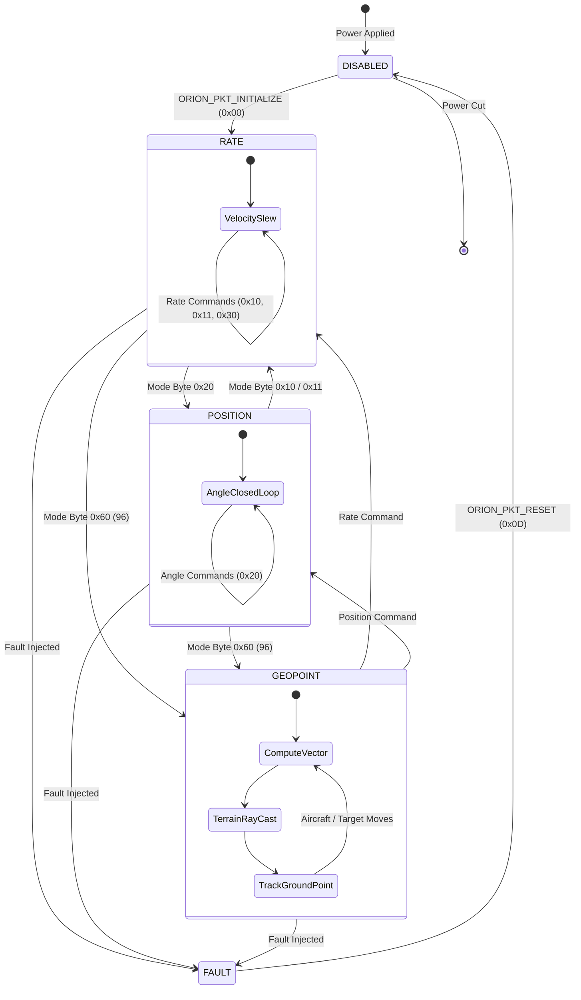
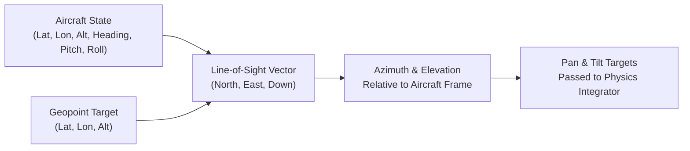

# Physics Engine & State Machine

This document covers the mechanical modeling, kinematic equations, numerical physics integration, and crown state machine implemented in **Orion-Shadow**.

---

## 🦾 Hardware Model: Trillium HD40-XV

Orion-Shadow explicitly simulates the physical specifications, motor characteristics, and optical geometry of the **Trillium Engineering HD40-XV** gyro-stabilized gimbal.

```
       +-----------------------+
       |   Aircraft Mount /    |
       |     Crown Board       |
       +-----------+-----------+
                   |  (Pan Axis: Continuous 360°)
                   v
             +-----------+
             | Pan Motor |
             +-----+-----+
                   |
            +------+------+
            | Tilt Motor  | (Tilt Axis: +15° to -90°)
            +------+------+
                   |
        +----------v----------+
        |  HD40-XV Optical    |
        |  Sensor Payload     |
        |  (KTnC 30x EO Core) |
        +---------------------+
```

### Physical & Electrical Specifications

| Parameter | Value | Notes |
| :--- | :--- | :--- |
| **Model** | Trillium HD40-XV | Lightweight, dual-axis tactical gimbal |
| **Diameter** | $98.0\text{ mm}$ ($3.86\text{ in}$) | Compact turret form factor |
| **Height** | $151.0\text{ mm}$ ($5.94\text{ in}$) | Profile height from base plate |
| **Weight** | $840.0\text{ g}$ ($1.85\text{ lbs}$) | Low payload weight for UAS integration |
| **Input Voltage** | $24.0\text{ VDC}$ nominal | Regulated bus ($18.0\text{V} - 32.0\text{V}$) |
| **Average Power** | $15.0\text{ W}$ | Steady-state stabilization power draw |
| **Peak Power** | $75.0\text{ W}$ | High-acceleration slews and cold starts |
| **Pan Travel** | Continuous $360^\circ$ | Slip-ring interface |
| **Tilt Travel** | $+15.0^\circ$ to $-90.0^\circ$ | Upward look to straight nadir |
| **Max Slew Rate** | $120.0^\circ / \text{s}$ | Commanded angular velocity limit |
| **Max Acceleration** | $300.0^\circ / \text{s}^2$ | Torque-limited axis acceleration |

---

## 🔄 Gimbal State Machine

The central state machine in `orion_shadow.core.state.GimbalState` orchestrates mode transitions, command decoding, and telemetry packet generation.



### Operational Modes

1. **`DISABLED` (`0x00`)**:
   - Motors unpowered. Position updates do not execute. Telemetry reports uninitialized status.
2. **`RATE` (`0x10`, `0x11`, `0x30`)**:
   - Commanded values represent desired angular slew rates in radians/sec.
   - Closed-loop rate stabilization dampens vehicle motion and maintains smooth panning.
3. **`POSITION` (`0x20`)**:
   - Commanded values represent target azimuth and elevation angles.
   - Physics engine accelerates toward target angles with realistic velocity limits and deceleration profiles.
4. **`GEOPOINT` (`0x60` / `96`)**:
   - Autonomous ground-gaze lock. The gimbal continually calculates the vector from the moving aircraft to a fixed earth coordinate (Latitude, Longitude, Altitude MSL).
5. **`SCENE_TRACK` / `TARGET_TRACK`**:
   - Driven by video tracking loops where optical flow or target centroid offsets generate correcting rate commands.

---

## 📐 Physics Integration & Dynamics Engine

Orion-Shadow models axis dynamics using second-order numerical integration rather than instant position assignment, accurately replicating motor torque limits, inertia, and mechanical friction.

### Mathematical Motion Model

At each simulation step $\Delta t$, for each axis (Pan and Tilt):

#### 1. Position Error & Desired Velocity
$$\Delta p = p_{\text{target}} - p_{\text{current}}$$

In Position mode, the desired velocity is proportional to position error, bounded by the maximum slew rate:
$$v_{\text{desired}} = \text{clamp}\left( K_p \cdot \Delta p, -v_{\max}, +v_{\max} \right)$$

#### 2. Acceleration Calculation
$$\Delta v = v_{\text{desired}} - v_{\text{current}}$$
$$a = \text{clamp}\left( \frac{\Delta v}{\Delta t}, -a_{\max}, +a_{\max} \right)$$

#### 3. Numerical Integration (Euler Step with Damping)
Mechanical friction and air resistance are modeled by applying a viscous damping factor $\mu$ ($0 < \mu < 1$):
$$v_{t+\Delta t} = \left( v_t + a \cdot \Delta t \right) \cdot (1 - \mu)$$
$$p_{t+\Delta t} = p_t + v_{t+\Delta t} \cdot \Delta t$$

#### 4. Mechanical Limit Clamping
For the Tilt axis, travel is bounded by mechanical hard stops:
$$p_{\text{tilt}} = \text{clamp}\left( p_{\text{tilt}}, -90.0^\circ, +15.0^\circ \right)$$
For continuous Pan axis, angles wrap seamlessly around $[0^\circ, 360^\circ)$ or $[-180^\circ, +180^\circ)$.

---

## 🎯 Geopoint Mode Kinematics

In **Geopoint Mode** (`0x60`), the user commands a stationary or moving ground target:
$$(\text{Lat}_{\text{target}}, \text{Lon}_{\text{target}}, \text{Alt}_{\text{target}})$$

The simulator solves the real-time line-of-sight vector:



1. **Local NED Conversion**:
   The target's geodetic coordinates are projected into the aircraft's local North-East-Down (NED) tangent plane using WGS84 ellipsoidal math:
   $$\Delta N = (Lat_{\text{target}} - Lat_{\text{ac}}) \cdot M$$
   $$\Delta E = (Lon_{\text{target}} - Lon_{\text{ac}}) \cdot N \cos(Lat_{\text{ac}})$$
   $$\Delta D = Alt_{\text{ac}} - Alt_{\text{target}}$$
2. **Azimuth & Elevation Calculation**:
   $$\text{Range}_{\text{ground}} = \sqrt{\Delta N^2 + \Delta E^2}$$
   $$\text{Azimuth}_{\text{true}} = \text{atan2}(\Delta E, \Delta N)$$
   $$\text{Elevation} = \text{atan2}(-\Delta D, \text{Range}_{\text{ground}})$$
3. **Aircraft Attitude Compensation**:
   Azimuth is rotated into the aircraft body frame by subtracting true heading:
   $$\text{Pan}_{\text{target}} = \text{Azimuth}_{\text{true}} - \psi_{\text{heading}}$$
   $$\text{Tilt}_{\text{target}} = \text{Elevation} - \theta_{\text{pitch}}$$

---

## ⏱️ SIL vs HIL Tuning Guidelines

The simulation update interval $\Delta t$ directly impacts physics fidelity and CPU load:

| Mode | Recommended $\Delta t$ | Frequency | Use Case |
| :--- | :--- | :--- | :--- |
| **SIL (Standard)** | `0.1s` | 10 Hz | Fast protocol tests, CI regression testing, GUI verification |
| **SIL (High-Rate)** | `0.02s` | 50 Hz | Control loop tuning, smooth synthetic video generation |
| **HIL (Real-Time)** | `0.01s` – `0.001s` | 100 – 1000 Hz | Embedded hardware controllers, autopilots, gyro-sampling loop emulation |

To start in high-rate mode:
```bash
python3 -m orion_shadow.server --dt 0.01
```
