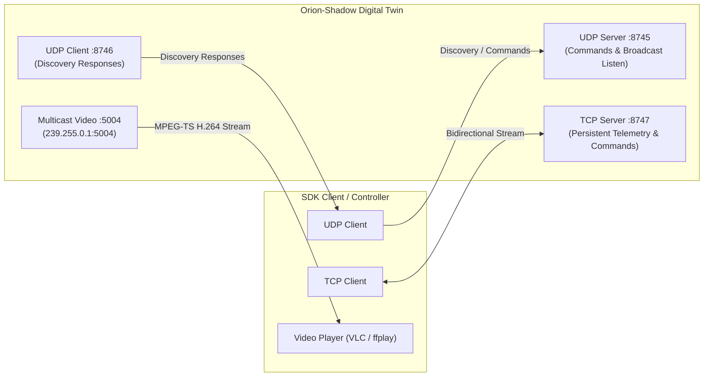

# OrionPublic Protocol & Network Specification

This document provides the definitive specification of the **OrionPublic Protocol** (version `1.4.0`) implemented in Orion-Shadow, targeting compatibility with **Orion SDK 3.1.9**.

---

## 🌐 Network Architecture & Port Allocations

The communication layer adheres to the standard network port definitions from the Orion SDK header `Communications/OrionComm.h`:



### Port Definitions

| Port Constant | Number | Transport | Purpose | Direction |
| :--- | :--- | :--- | :--- | :--- |
| `UDP_OUT_PORT` | `8745` | UDP | Discovery broadcasts and connectionless datagram commands | Inbound to Simulator |
| `UDP_IN_PORT` | `8746` | UDP | Discovery handshake responses sent back to SDK client broadcast listener | Outbound to Client |
| `TCP_PORT` | `8747` | TCP | Persistent, bidirectional command and high-rate telemetry session | Bidirectional |
| `VIDEO_PORT` | `5004` | UDP (Multicast) | H.264 video stream wrapped in MPEG-TS (`239.255.0.1`) | Outbound to Clients |

---

## 📦 Packet Framing Standard

Every datagram or stream packet sent or received MUST adhere to the big-endian OrionPublic framing standard:

```
+--------+--------+--------+--------+------------------------+--------+--------+
| Sync0  | Sync1  |   ID   | Length |      Payload Data      | Fletch0| Fletch1|
| (0xD0) | (0x0D) | (0-255)| (0-140)|      (0..140 bytes)    | (MSB)  | (LSB)  |
| 1 byte | 1 byte | 1 byte | 1 byte |        L bytes         | 1 byte | 1 byte |
+--------+--------+--------+--------+------------------------+--------+--------+
|<--------------------------- Checksummed Region ----------------------------->|
```

### Frame Fields

1. **`Sync0` (`0xD0`)**: Protocol synchronization byte 0 (decimal 208).
2. **`Sync1` (`0x0D`)**: Protocol synchronization byte 1 (decimal 13).
3. **`ID`**: Unsigned 8-bit packet type identifier (`0` to `255`).
4. **`Length`**: Unsigned 8-bit length of the payload data ($L \le 140$ bytes).
5. **`Payload Data`**: $L$ contiguous bytes of packet-specific binary data.
6. **`Fletch0` / `Fletch1`**: 16-bit modified Fletcher's checksum in big-endian network byte order.

---

## 🧮 Fletcher-16 Checksum Algorithm (Modulo-251)

> [!CRITICAL]
> Standard Fletcher-16 checksums use modulo 255. The Trillium Orion protocol uses **modulo 251** (the largest prime number strictly less than $2^8$). Any packet calculated with modulo 255 will fail validation and be discarded.

### Algorithm Description
1. Initialize two 16-bit accumulators: $a = 1$, $b = 1$.
2. Iterate through every byte in the packet **including** the sync bytes, packet ID, length field, and all payload bytes:
   $$a = (a + \text{byte}) \pmod{251}$$
   $$b = (b + a) \pmod{251}$$
3. Combine accumulators into a 16-bit checksum:
   $$\text{Checksum} = (b \ll 8) \mid a$$
4. Append to packet as two bytes: high byte ($b$) followed by low byte ($a$).

### Python Implementation (`orion_shadow.core.protocol`)
```python
def compute_checksum(packet_bytes: bytes) -> int:
    a = 1
    b = 1
    for byte in packet_bytes:
        a = (a + byte) % 251
        b = (b + a) % 251
    return (b << 8) | a
```

### C Reference Implementation (`TrilliumPacket.c`)
```c
uint16_t ComputeFletcher251(const uint8_t *pData, uint16_t length)
{
    uint16_t a = 1;
    uint16_t b = 1;
    for (uint16_t i = 0; i < length; i++)
    {
        a = (a + pData[i]) % 251;
        b = (b + a) % 251;
    }
    return (b << 8) | a;
}
```

---

## 📑 Complete Packet Catalog

### `0x00` — `ORION_PKT_INITIALIZE`
- **Direction**: Inbound / Outbound
- **Payload Size**: 0 bytes
- **Description**: Sent by the client upon connecting to announce its presence. The simulator registers the client's network address and replies with an `INITIALIZE` packet and a `VERSION` packet (`0x02`).

---

### `0x01` — `ORION_PKT_CMD`
- **Direction**: Inbound (echoed outbound to all clients)
- **Payload Size**: 4, 5, or 8 bytes
- **Description**: Primary motion control command for Pan and Tilt axes.
- **Payload Formats**:

#### Format A: 8-byte Floating Point (Legacy/Direct Angle)
| Byte Offset | Type | Field | Description |
| :--- | :--- | :--- | :--- |
| `0..3` | `float32` (BE) | `target_pan` | Target Pan angle in degrees |
| `4..7` | `float32` (BE) | `target_tilt` | Target Tilt angle in degrees |

#### Format B: 5-byte Scaled Integer + Mode (Standard OrionPublic)
| Byte Offset | Type | Field | Description |
| :--- | :--- | :--- | :--- |
| `0..1` | `int16` (BE) | `pan_raw` | Scaled value ($1000 \times \text{radians}$) |
| `2..3` | `int16` (BE) | `tilt_raw` | Scaled value ($1000 \times \text{radians}$) |
| `4` | `uint8` | `mode` | Gimbal operating mode (see Modes below) |

**Gimbal Operating Modes**:
- `0x00`: `DISABLED` / Retracted
- `0x10`, `0x11`, `0x30`: `RATE` Mode (inputs are slew rates in radians/sec)
- `0x20`: `POSITION` Mode (inputs are target gimbal angles in radians)
- `0x60` (`96`): `GEOPOINT` Mode (autonomous ground target gaze tracking)

---

### `0x02` — `ORION_PKT_VERSION`
- **Direction**: Outbound
- **Payload Size**: 8 bytes
- **Description**: Reports crown board firmware, hardware revision, and OrionPublic protocol version.
| Byte Offset | Type | Field | Default Value |
| :--- | :--- | :--- | :--- |
| `0` | `uint8` | `proto_major` | `1` |
| `1` | `uint8` | `proto_minor` | `4` |
| `2` | `uint8` | `proto_patch` | `0` |
| `3` | `uint8` | `crown_major` | `3` |
| `4` | `uint8` | `crown_minor` | `1` |
| `5` | `uint8` | `crown_patch` | `9` |
| `6..7` | `uint16` (BE) | `hardware_id` | `0x4040` (HD40) |

---

### `0x03` — `ORION_PKT_CAMERAS`
- **Direction**: Inbound (query) / Outbound (descriptor payload)
- **Payload Size**: Variable
- **Description**: Describes available camera sensors, optical limits, and pixel pitches.
- **Reported HD40-XV Payload**:
  - Camera Index: `0`
  - Sensor Type: `CAMERA_TYPE_VISIBLE` (`1`)
  - Protocol Type: `CAMERA_PROTO_KTNC` (`7`)
  - Optical Zoom Range: $1.0\times$ to $30.0\times$ ($4.3\text{mm} - 129.0\text{mm}$)
  - Digital Zoom Range: Up to $112.0\times$ total ($0.4^\circ$ HFOV)
  - Native Resolution: $1280 \times 720$

---

### `0x04` — `ORION_PKT_CAMERA_CMD`
- **Direction**: Inbound
- **Payload Size**: 4 bytes
- **Description**: Commands optical zoom magnification and manual focus position.
| Byte Offset | Type | Field | Description |
| :--- | :--- | :--- | :--- |
| `0..1` | `uint16` (BE) | `zoom_raw` | Commanded optical zoom ($100 \times \text{zoom factor}$) |
| `2..3` | `int16` (BE) | `focus_raw` | Commanded focus position ($0..1000$) |

---

### `0x05` — `ORION_PKT_CAMERA_STATE`
- **Direction**: Outbound
- **Payload Size**: 4 bytes
- **Description**: Telemetry reporting current optical zoom and focus state.
| Byte Offset | Type | Field | Description |
| :--- | :--- | :--- | :--- |
| `0..1` | `uint16` (BE) | `zoom_raw` | Current zoom factor ($100 \times \text{zoom}$) |
| `2..3` | `int16` (BE) | `focus_raw` | Current focus value |

---

### `0x07` — `ORION_PKT_KTNC_SETTINGS`
- **Direction**: Inbound / Outbound
- **Payload Size**: 16 bytes
- **Description**: Configures low-level DSP settings for the KTnC visible camera core:
  - Sharpness, Contrast, Saturation
  - Vertical flip, Night mode (IR-cut filter removal)
  - Integration time & exposure compensation

---

### `0x08` — `ORION_PKT_VIDEO_TRACK_CMD`
- **Direction**: Inbound
- **Payload Size**: 10 bytes
- **Description**: Controls onboard video tracking modes:
  - Mode: `0` (None), `1` (Scene Lock), `2` (Target / Object Centroid Track)
  - Target normalized image coordinates $(X, Y)$ and bounding box dimensions.

---

### `0x09` — `ORION_PKT_VIDEO_TRACK_STATE`
- **Direction**: Outbound
- **Payload Size**: 14 bytes
- **Description**: Broadcasts video tracker telemetry: track state, normalized center $(X, Y)$, box width/height, and tracking confidence score ($0..100\%$).

---

### `0x0A` — `ORION_PKT_POSITIONS`
- **Direction**: Outbound
- **Payload Size**: 16 bytes
- **Description**: Primary high-rate motion telemetry.
| Byte Offset | Type | Field | Description |
| :--- | :--- | :--- | :--- |
| `0..1` | `int16` (BE) | `pan_pos` | Current Pan angle ($1000 \times \text{rad}$) |
| `2..3` | `int16` (BE) | `tilt_pos` | Current Tilt angle ($1000 \times \text{rad}$) |
| `4..5` | `int16` (BE) | `roll_pos` | Current Roll angle ($1000 \times \text{rad}$) |
| `6..7` | `int16` (BE) | `pan_target` | Target Pan angle ($1000 \times \text{rad}$) |
| `8..9` | `int16` (BE) | `tilt_target` | Target Tilt angle ($1000 \times \text{rad}$) |
| `10..11`| `int16` (BE) | `pan_rate` | Pan angular velocity ($1000 \times \text{rad/s}$) |
| `12..13`| `int16` (BE) | `tilt_rate` | Tilt angular velocity ($1000 \times \text{rad/s}$) |
| `14` | `uint8` | `mode` | Active gimbal mode |
| `15` | `uint8` | `status_flags` | Axis locks, limit stops, fault indicator |

---

### `0x0B` — `ORION_PKT_DIAGNOSTICS`
- **Direction**: Outbound
- **Payload Size**: 18 bytes
- **Description**: Real-time health, thermal, and electrical telemetry:
  - Voltage rails: 5V rail, 12V rail, 24V primary rail ($mV$)
  - Core temperature & motor driver temperatures ($^\circ C$)
  - Total current draw ($mA$)
  - Active hardware fault bitmask

---

### `0x0C` — `ORION_PKT_GEO_DATA`
- **Direction**: Outbound
- **Payload Size**: 24 bytes
- **Description**: Target geolocation computed from ray-casting camera boresight onto DTED terrain:
| Byte Offset | Type | Field | Description |
| :--- | :--- | :--- | :--- |
| `0..3` | `int32` (BE) | `target_lat` | Target Latitude ($10^7 \times \text{deg}$) |
| `4..7` | `int32` (BE) | `target_lon` | Target Longitude ($10^7 \times \text{deg}$) |
| `8..11` | `int32` (BE) | `target_alt` | Target Altitude MSL ($1000 \times \text{m}$) |
| `12..15`| `uint32` (BE) | `slant_range` | Slant range to target ($100 \times \text{m}$) |
| `16..19`| `int32` (BE) | `ground_elevation` | Terrain height under target ($1000 \times \text{m}$) |
| `20..23`| `uint32` (BE) | `geo_flags` | Line-of-sight valid, terrain intercept valid |

---

### `0x10` & `0x11` — `ORION_PKT_LASER_CMD` / `ORION_PKT_LASER_STATE`
- **Direction**: Inbound (`0x10`) / Outbound (`0x11`)
- **Payload Size**: 2 bytes / 6 bytes
- **Description**: Laser pointer and rangefinder armed state, firing status, pulse rate, and power output ($0.0 - 1.0$).

---

### `0xD1` — `ORION_PKT_GPS_DATA`
- **Direction**: Inbound / Outbound
- **Payload Size**: 28 bytes
- **Description**: Aircraft navigation telemetry feeding platform location:
  - Latitude, Longitude, Altitude MSL, Altitude AGL
  - Groundspeed ($m/s$), Course Over Ground, Vertical Speed

---

### `0xD2` — `ORION_PKT_EXT_HEADING_DATA`
- **Direction**: Inbound / Outbound
- **Payload Size**: 8 bytes
- **Description**: Aircraft platform true heading ($1000 \times \text{rad}$) and heading validity status.

---

## 📢 Command Echoing Behavior

In real Trillium Orion gimbals, commands received over UDP or TCP are immediately echoed back onto the network. Orion-Shadow strictly replicates this behavior:
- Whenever any client issues a valid `ORION_PKT_CMD`, `ORION_PKT_CAMERA_CMD`, or `ORION_PKT_KTNC_SETTINGS`, the server updates internal state and immediately re-transmits the exact packet to **all** connected UDP and TCP endpoints.
- This allows external telemetry consoles, payload controllers, and test loggers to remain fully synchronized in real time.
