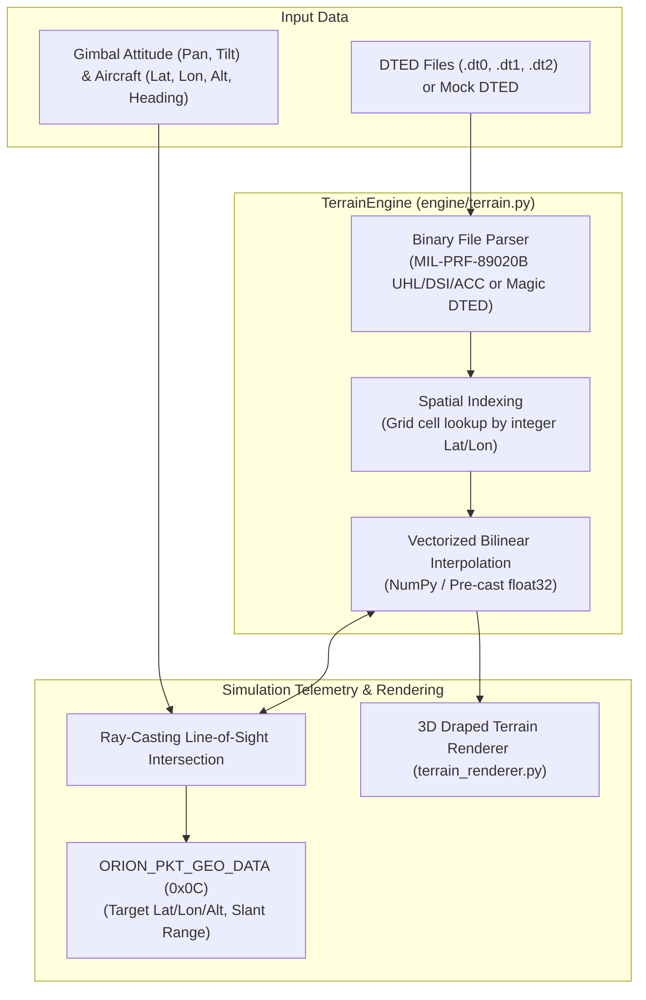
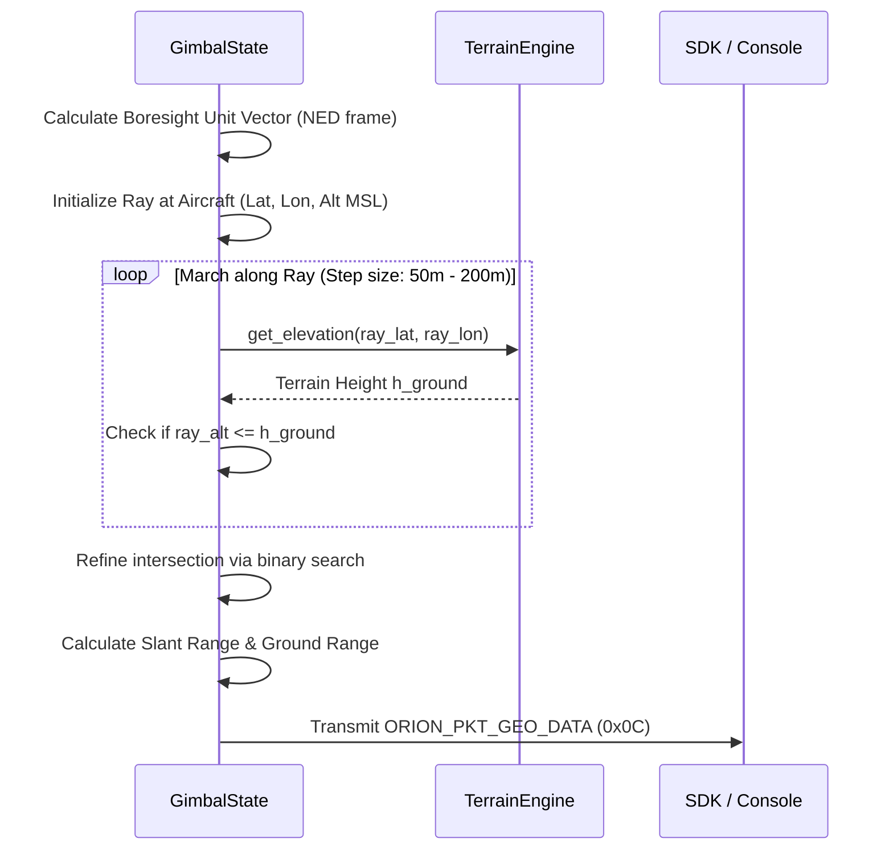

# Terrain & Geospatial Engine

This document provides a technical guide to the **TerrainEngine** in Orion-Shadow, detailing military DTED format parsing, geodetic WGS84 coordinate systems, fast elevation interpolation, and ray-casting target geolocation.

---

## 🏔️ Overview

In airborne surveillance systems, target tracking and laser ranging are deeply dependent on the underlying terrain. Orion-Shadow includes a high-performance terrain engine capable of:
1. Parsing standard Military Specification (MIL-PRF-89020B) Digital Terrain Elevation Data (**DTED Level 0, 1, and 2**).
2. Performing ultra-fast vectorized bilinear elevation interpolation across multiple geographic tiles.
3. Conducting ray-casting intersection tests along the camera's optical line-of-sight vector to calculate real-world target coordinates (Latitude, Longitude, MSL Altitude) and slant range.
4. Seamlessly falling back to a mathematical WGS84 sea-level ellipsoid model when terrain data is absent.



---

## 📁 DTED File Format Support

The simulator supports both standard military DTED files and custom lightweight mock DTED binaries.

### Supported Standards

| Level | Post Spacing (Arc-sec) | Metric Resolution | Typical File Extension |
| :--- | :--- | :--- | :--- |
| **DTED Level 0** | $30.0''$ | $\approx 900\text{ m}$ | `.dt0` |
| **DTED Level 1** | $3.0''$ | $\approx 90\text{ m}$ | `.dt1` |
| **DTED Level 2** | $1.0''$ | $\approx 30\text{ m}$ | `.dt2` |

### 1. MIL-PRF-89020B Standard Header & Record Layout
Standard military DTED files are structured into 80-byte User Header Labels (UHL), 648-byte Data Set Identification (DSI) records, and 2700-byte Accuracy Description (ACC) records:

```
+--------------------+---------------------+---------------------+----------------------+
| UHL (Bytes 0..79)  | DSI (Bytes 80..727) | ACC (Bytes 728..3427)| Elevation Records    |
| Magic 'UHL'        | Latitude/Longitude  | Horizontal/Vertical | Data begins at byte  |
| Origin & Spacing   | Coverage Bounds     | Accuracy Metadata   | offset 3428          |
+--------------------+---------------------+---------------------+----------------------+
```

- **Origin Coordinates**: Extracted from UHL string coordinates (e.g., `0340000N`, `1190000W`).
- **Data Columns**: Each column record contains:
  - Record header (`8` bytes): Sentinel byte (`0xAA`), record sequence number, longitude count, latitude count.
  - Elevation data ($Rows \times 2$ bytes): Signed 16-bit big-endian integers (`>i2`) representing elevation in meters above the EGM96 geoid. Null/void values ($< -1000\text{m}$) are clamped to sea level ($0.0\text{m}$).
  - Checksum (`4` bytes).

### 2. Simulation Mock DTED Format
For testing and development without classified or large GIS datasets, Orion-Shadow defines a compact binary format:
| Byte Offset | Type | Field | Description |
| :--- | :--- | :--- | :--- |
| `0..3` | `bytes[4]` | `Magic` | Sentinel identifier `b'DTED'` |
| `4..7` | `uint32` (BE) | `rows` | Number of elevation rows (latitude) |
| `8..11` | `uint32` (BE) | `cols` | Number of elevation columns (longitude) |
| `12..19`| `float64` (BE)| `lat_min` | Minimum latitude bounding box |
| `20..27`| `float64` (BE)| `lat_max` | Maximum latitude bounding box |
| `28..35`| `float64` (BE)| `lon_min` | Minimum longitude bounding box |
| `36..43`| `float64` (BE)| `lon_max` | Maximum longitude bounding box |
| `44+` | `uint16` (BE) | `elevations`| Contiguous row-major elevation array ($Rows \times Cols \times 2$ bytes) |

---

## 🧮 Fast Bilinear Elevation Interpolation

To prevent interpolation lag during high-frequency ray marching and rendering (where dozens of elevation lookups occur per frame), `DTEDTile` uses pre-cast `float32` arrays:

1. **Normalized Cell Coordinates**:
   $$\text{row\_frac} = \frac{\text{lat} - \text{lat}_{\min}}{\text{lat}_{\max} - \text{lat}_{\min}} \cdot (\text{rows} - 1)$$
   $$\text{col\_frac} = \frac{\text{lon} - \text{lon}_{\min}}{\text{lon}_{\max} - \text{lon}_{\min}} \cdot (\text{cols} - 1)$$
2. **Surrounding Grid Nodes**:
   $$r_0 = \lfloor \text{row\_frac} \rfloor, \quad r_1 = \min(r_0 + 1, \text{rows} - 1), \quad \Delta r = \text{row\_frac} - r_0$$
   $$c_0 = \lfloor \text{col\_frac} \rfloor, \quad c_1 = \min(c_0 + 1, \text{cols} - 1), \quad \Delta c = \text{col\_frac} - c_0$$
3. **Interpolated Elevation**:
   $$\begin{aligned}
   h(\text{lat}, \text{lon}) &= (1 - \Delta r)(1 - \Delta c) \cdot V_{r_0, c_0} + (1 - \Delta r)\Delta c \cdot V_{r_0, c_1} \\
   &+ \Delta r (1 - \Delta c) \cdot V_{r_1, c_0} + \Delta r \Delta c \cdot V_{r_1, c_1}
   \end{aligned}$$

---

## 🎯 Line-of-Sight Ray Casting & Geolocation

When computing target coordinates for `ORION_PKT_GEO_DATA` (`0x0C`):



### Mathematical Formulation
1. **Camera Look Direction in NED**:
   Given aircraft heading $\psi$, pitch $\theta$, roll $\phi$, and gimbal pan $\alpha$, tilt $\beta$:
   $$\mathbf{v}_{\text{NED}} = \mathbf{R}_{\text{aircraft}}(\psi, \theta, \phi) \cdot \mathbf{R}_{\text{gimbal}}(\alpha, \beta) \cdot \begin{bmatrix} 1 \\ 0 \\ 0 \end{bmatrix}$$
2. **Ray Marching**:
   Starting at platform position $\mathbf{p}_0 = [\text{Lat}_{\text{ac}}, \text{Lon}_{\text{ac}}, \text{Alt}_{\text{ac}}]$, distance along ray $s$ progresses:
   $$\mathbf{p}(s) = \mathbf{p}_0 + s \cdot \mathbf{v}_{\text{NED}}$$
   At each step, query $h_{\text{ground}} = \text{TerrainEngine.get\_elevation}(\text{Lat}(s), \text{Lon}(s))$.
3. **Convergence**:
   When $\text{Alt}(s) \le h_{\text{ground}}$, the ray has intersected terrain. The simulator executes a binary search to pinpoint the exact intersection within centimeter precision.
4. **Fallback Model**:
   If no DTED data is loaded or the camera is pointing above the horizon ($\beta \ge 0^\circ$), the ray projects to the WGS84 reference ellipsoid ($h = 0.0\text{m}$ MSL).

---

## 💻 Enabling Terrain in the CLI

To enable terrain simulation, point the `--dted-path` flag to either a single DTED file or a root directory containing `.dt0` / `.dt1` / `.dt2` tiles:

```bash
# Using a specific DTED file
python3 -m orion_shadow.server --dted-path ./tests/terrain_data/slope.dt1

# Using a regional DTED directory tree
python3 -m orion_shadow.server --dted-path /mnt/data/map_data/DTED/
```

When active, the simulator logs:
```
[*] TerrainEngine enabled with path: /path/to/dted
[+] 3D Draped Terrain Visualization active (DTED + Map Tiles)
```
