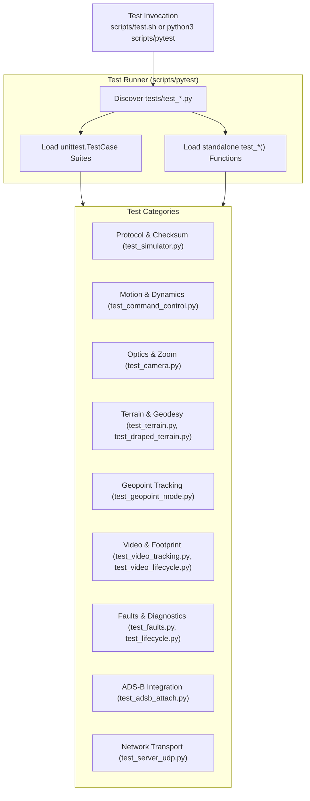

# Testing & Development Guide

This document describes the testing architecture, test suites, mock data generators, and development practices for **Orion-Shadow**.

---

## 🧪 Testing Architecture

Orion-Shadow includes a comprehensive suite of unit, integration, and mock tests located in the `tests/` directory.

Because embedded systems and minimal container environments may lack third-party testing dependencies, Orion-Shadow provides a standalone test runner (`scripts/pytest`) that mimics pytest discovery and executes both `unittest.TestCase` classes and standalone `test_*` functions using only the Python standard library.



---

## 🏃 Running the Tests

### 1. Run the Entire Test Suite
Using the test shell runner:
```bash
./scripts/test.sh
```

Or calling the runner directly:
```bash
python3 scripts/pytest
```

If standard `pytest` is installed in your virtual environment:
```bash
pytest
```

### 2. Run a Specific Test Module
Target individual test modules for rapid feedback:
```bash
# Run camera and zoom optics tests
./scripts/test.sh tests/test_camera.py

# Run DTED terrain elevation tests
./scripts/test.sh tests/test_terrain.py

# Run autonomous geopoint tracking tests
./scripts/test.sh tests/test_geopoint_mode.py

# Run ADS-B aircraft attach bridge tests
./scripts/test.sh tests/test_adsb_attach.py
```

---

## 📁 Test Inventory & Coverage

| Test File | Subsystem Under Test | Key Assertions & Scenarios |
| :--- | :--- | :--- |
| `tests/test_simulator.py` | Protocol & Basic State | Fletcher-251 checksum encoding, sync detection, state step integration. |
| `tests/test_camera.py` | Camera Payloads | 30x optical / 112x digital zoom, focal length limits, HFOV/VFOV trigonometry. |
| `tests/test_terrain.py` | TerrainEngine | MIL-PRF-89020B DTED header parsing, cell bounds, bilinear elevation accuracy. |
| `tests/test_draped_terrain.py`| 3D Relief Renderer | Relief mesh construction, texture mapping homography, distance LOD. |
| `tests/test_geopoint_mode.py` | Geopoint Tracking | Autonomous LOS tracking of stationary and moving earth coordinates. |
| `tests/test_video_tracking.py`| Optical Footprint | Trapezoidal camera footprint on terrain, continuous pitch/zoom changes. |
| `tests/test_video_lifecycle.py`| Video Server | VideoServer startup, synthetic frame generation, pipeline termination. |
| `tests/test_faults.py` | FaultEngine | Motor overcurrent injection, sensor freeze, comms dropout recovery. |
| `tests/test_server_udp.py` | Network Layer | Discovery handshake, UDP client address tracking, packet dispatch. |
| `tests/test_lifecycle.py` | Lifecycle Management | Reset commands (`0x0D`), motor startup sequencing (`0x0E`), diagnostics (`0x0B`). |
| `tests/test_adsb_attach.py` | ADS-B Bridge | REST API response parsing, Haversine sorting, packet conversion. |
| `tests/test_tile_cache.py` | Tile Cache Engine | Disk caching, hierarchical parent tile fallback synthesis, LRU eviction. |
| `tests/test_command_control.py`| Motion Control | Rate mode slew, position mode convergence, velocity and acceleration limits. |
| `tests/test_hud_speed.py` | Video HUD | Airspeed and groundspeed HUD box rendering, knot conversions. |
| `tests/test_config.py` | Configuration | Command-line argument parsing, environment defaults, invalid argument traps. |

---

## ⛰️ Generating Mock DTED Terrain Files

To test elevation algorithms without large military elevation files, a synthetic DTED generator is available at `tests/generate_mock_dted.py`:

```bash
python3 tests/generate_mock_dted.py
```

This utility generates:
- `tests/terrain_data/flat.dt0`: Flat plain at $100\text{ m}$ MSL elevation.
- `tests/terrain_data/slope.dt1`: Linear gradient terrain sloping from $100\text{ m}$ to $2000\text{ m}$ MSL.
- `tests/terrain_data/mountain.csv` / `lowland.csv`: Benchmark elevation profiles.

---

## 🛠️ Guidelines for Adding New Features

When extending Orion-Shadow with new packet types or sensor models:

1. **Protocol Constants**:
   Add the packet ID enum to `orion_shadow.core.protocol.OrionPktType`.
2. **Binary Serializers / Deserializers**:
   Implement big-endian pack and unpack methods in `orion_shadow.core.protocol` and register handlers in `orion_shadow.core.engine.ProtocolEngine`.
3. **State Integration**:
   Update `orion_shadow.core.state.GimbalState` to manage the new state attributes and handle the command packet.
4. **Telemetry Dispatch**:
   If the packet is an outbound telemetry message, hook it into `OrionServer.simulation_loop()` at an appropriate dispatch interval.
5. **Unit Test Verification**:
   Create a dedicated unit test in `tests/test_<feature>.py` verifying both encoding/decoding and state machine reactions.
