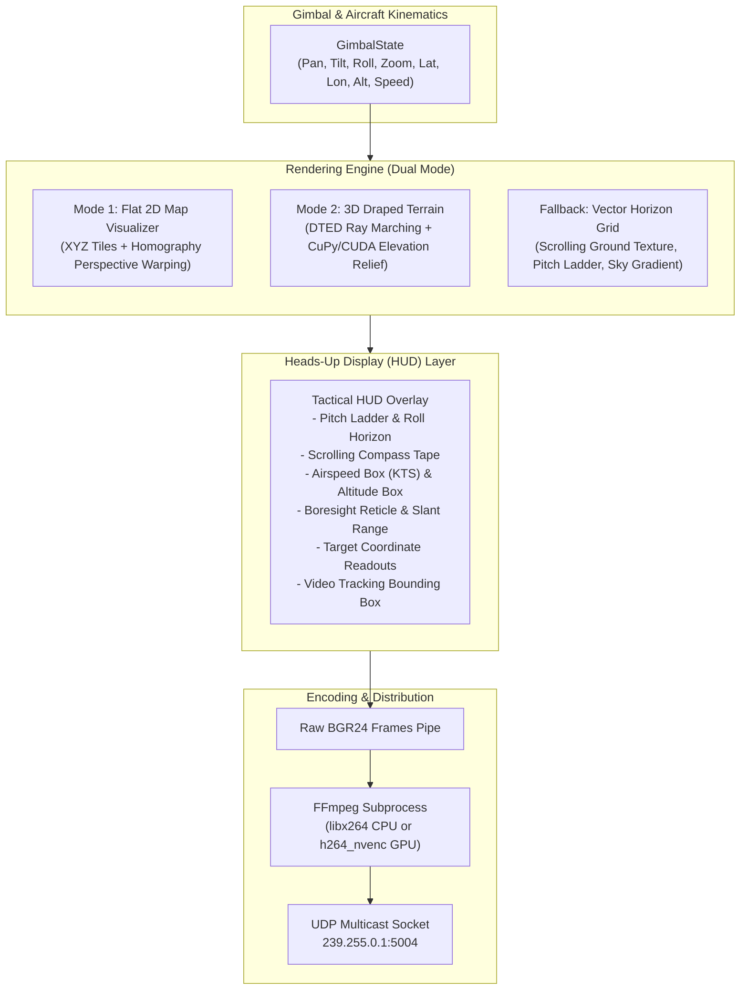

# Synthetic Video & Rendering Pipeline

This document details the synthetic video rendering engine, map tile fetching, 3D relief draping, Heads-Up Display (HUD) overlays, and FFmpeg multicast streaming architecture in **Orion-Shadow**.

---

## 🎥 Pipeline Architecture

Orion-Shadow includes an integrated synthetic electro-optical (EO) camera stream generator (`orion_shadow.engine.video_server.VideoServer`). It produces a real-time, low-latency H.264 video feed encoded into an MPEG-TS container and broadcast via UDP multicast (`udp://@239.255.0.1:5004`).



---

## 🖼️ Rendering Backends

Orion-Shadow dynamically selects its rendering backend based on the CLI flags provided at startup:

### 1. Mode 1: Flat 2D Map Visualizer (`visualizer.py`)
- **Trigger**: `--tile-url <template>` provided without DTED elevation data.
- **Mechanism**:
  - Downloads slippy map XYZ tiles (e.g. Google Maps, OpenStreetMap, ESRI World Imagery).
  - Determines adaptive tile zoom based on aircraft altitude and optical Field of View (FOV).
  - Projects the camera footprint trapezoid onto the ground plane using homography perspective warping (`cv2.warpPerspective`).
- **Disk Caching**: Tiles are permanently cached to disk (`cache/tiles/`) to enable rapid offline reuse and eliminate bandwidth bottlenecks.
- **Hierarchical Fallback**: If a high-resolution tile is not yet downloaded, the visualizer automatically crops and upscales available lower-resolution parent tiles using Lanczos-4 or Bicubic interpolation to prevent dropped frames.

### 2. Mode 2: 3D Draped Terrain Renderer (`terrain_renderer.py`)
- **Trigger**: Both `--tile-url <template>` and `--dted-path <path>` provided.
- **Mechanism**:
  - The `TerrainDraper` casts rays from the camera nodal point into the 3D DTED elevation grid.
  - Generates a dense 3D elevation relief mesh matching actual terrain topography.
  - Drapes downloaded map tiles onto the irregular terrain relief via projective texture mapping.
  - Subsampling Factor (`--drape-subsample`, default: `6`): Ray-marches at lower screen resolution and upscales the depth buffer, providing high rendering frame rates without sacrificing visual detail.
  - Distance Level of Detail (LOD): Automatically steps down tile zoom for distant mountain ranges to reduce memory consumption.

### 3. Fallback: Procedural Vector Sky & Ground Grid
- **Trigger**: No `--tile-url` provided.
- **Mechanism**:
  - Renders a clean, tactical flight simulation view with an atmospheric gradient sky, pitch-responsive horizon line, and a dynamic 3D ground perspective grid.
  - Ground grid texture dynamically scrolls in real time proportional to aircraft groundspeed and heading.

---

## 🎯 Heads-Up Display (HUD) Symbology

The HUD layer (`_draw_hud`) renders military-standard electro-optical gimbal symbology directly onto every frame:

```
+-------------------------------------------------------------------------+
| LAT: 39°36'00.0"N  LON: 116°18'00.0"W  ALT: 2500M MSL  HDG: 090°  30.0x |
|                        [  080  |  090  |  100  ]                        |
|                               (Compass Tape)                            |
|                                                                         |
|  +-------+                        |                                     |
|  |180 KTS|                   -- 10|10 --                                |
|  +-------+                        |                                     |
|                                -|- -|-                                  |
|                             --|   +   |--                               |
|                                -|- -|-                                  |
|                                   |                     +--------+      |
|                              -- 10|10 --                | 8200 FT|      |
|                                                         +--------+      |
|                              [  LOCK  ]                                 |
|                         (Tracking Target Box)                           |
|                                                                         |
| PAN: +045.2°  TILT: -20.1°  MODE: GEOPOINT  SLANT: 3840M  ELEV: 412M   |
+-------------------------------------------------------------------------+
```

### HUD Elements
1. **Top Header**: Real-time aircraft latitude, longitude, altitude MSL, true heading, and current optical/digital zoom factor ($1.0\times - 112.0\times$).
2. **Moving Compass Tape**: Top-centered ribbon scrolling smoothly with camera azimuth. Features cardinal labels (`N`, `E`, `S`, `W`) and tick marks every $5^\circ$.
3. **Airspeed Box**: Left-hand margin readout indicating aircraft calibrated airspeed or groundspeed in knots (`KTS`).
4. **Altitude Box**: Right-hand margin readout indicating barometric MSL or radar AGL altitude.
5. **Pitch Ladder & Roll Horizon**: Inverted "T" and numbered degree ladder bars reflecting camera depression and aircraft bank angle.
6. **Center Reticle**: Crosshair reticle with millimeter alignment brackets indicating camera optical boresight.
7. **Bottom Telemetry Footer**: Commanded vs actual pan/tilt angles, active gimbal mode (`RATE`, `POSITION`, `GEOPOINT`), calculated slant range, and terrain ground elevation.
8. **Target & Tracking Overlays**: Bounding boxes for active video tracks and diamond target reticles for Geopoint locks.

---

## 🚀 GPU Acceleration & FFmpeg Encoding

Orion-Shadow supports high-efficiency hardware acceleration for both 3D rendering and video encoding:

### 1. Hardware Video Encoding (NVIDIA NVENC)
When supported by the host GPU and FFmpeg, Orion-Shadow uses `h264_nvenc` to offload video encoding from the CPU:
```bash
# Force NVIDIA GPU video encoding
python3 -m orion_shadow.server --gpu-encoding

# Force CPU encoding (libx264)
python3 -m orion_shadow.server --no-gpu-encoding
```

### 2. CuPy CUDA Ray Marching
When the optional CUDA libraries are installed, `terrain_renderer.py` automatically routes 3D ray-marching mathematical operations through **CuPy**, executing elevation lookups in parallel across GPU CUDA cores.

### 3. Lookahead Tile Prefetching
To eliminate visual tile-loading pop-in while the aircraft flies at high speeds, an asynchronous background worker calculates the aircraft's projected position up to `--prefetch-distance` ahead (default $10,000\text{ m}$) along its ground velocity vector, queuing downloads before the camera FOV arrives:
```bash
# Adjust lookahead prefetch buffer
python3 -m orion_shadow.server --prefetch-distance 20000.0
```

---

## 📺 Receiving the Stream

The multicast video stream is transmitted over UDP to `239.255.0.1:5004`. Any standard player can receive the stream without latency buffering.

### VLC Media Player
```bash
vlc --network-caching=50 udp://@239.255.0.1:5004
```

### FFplay (Ultra Low-Latency)
```bash
ffplay -fflags nobuffer -flags low_delay -framedrop udp://239.255.0.1:5004
```

### GStreamer Pipeline
```bash
gst-launch-1.0 udpsrc address=239.255.0.1 port=5004 ! "application/x-rtp, media=(string)video" ! rtph264depay ! avdec_h264 ! autovideosink sync=false
```
